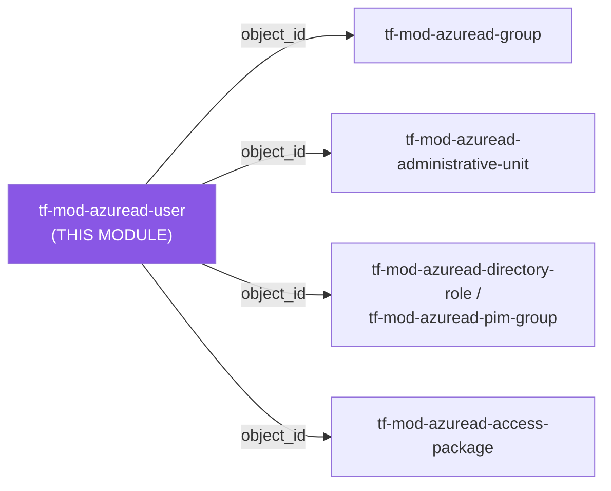
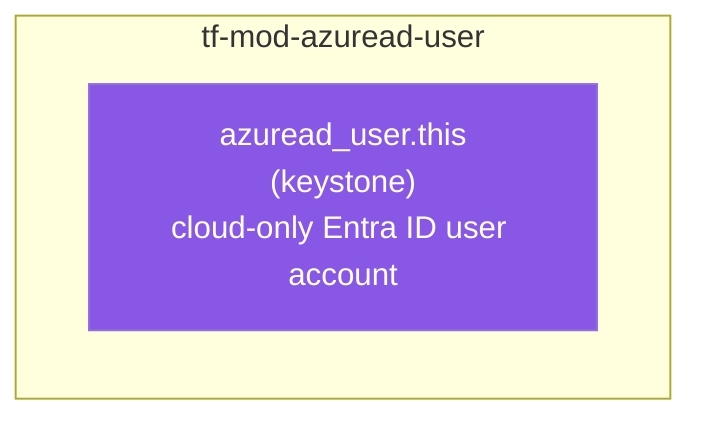

# 👤 Azure AD **User** Terraform Module

> **Creates and manages a single cloud-only Microsoft Entra ID user account** — typed flat-attribute schema mirroring `azuread_user` 1:1, enum `validation {}` blocks, secure-by-default account controls, a write-only `password` held only in state, and `object_id` surfaced for membership/role wiring. Built for azuread **v3.x**.

    

---

## 🧩 Overview

This module manages one **`azuread_user`** resource — a cloud-only (directory-native) user account in your Entra tenant.

- 🆔 Creates **one** user with a required `display_name` and `user_principal_name` (UPN).
- 🔐 **Write-only credential** — `password` is a `sensitive` input; the Graph API never returns it after creation, so it is **never emitted as an output**. Defaults pair an operator-set password with `force_password_change = true`.
- 🛡️ **Secure-by-default account controls** — `account_enabled = true`, `force_password_change = true`, `disable_password_expiration = false`, `disable_strong_password = false`, `show_in_address_list = true`.
- ✅ **Type-as-contract** — every one of the resource's flat attributes is a typed top-level variable with baked-in defaults; `age_group`, `consent_provided_for_minor`, `usage_location`, `business_phones`, UPN format, and `employee_hire_date` are enforced by `validation {}` at plan time.
- 🔑 Emits **`object_id`** — the universal key consumed by group membership, administrative-unit membership, directory-role assignments, access-package approver/requestor references, and `manager_id` references.
- ✅ Built and validated against **`hashicorp/azuread` `>= 2.0, < 4.0`** (verified against **v3.9.0**) — no attribute on `azuread_user` is `ForceNew`, so every change (including `user_principal_name`) updates in place rather than forcing a destroy/recreate.

> 💡 **Why it matters:** Service accounts, break-glass identities, and provisioned users defined as code are reviewable, versioned, and auditable — instead of hand-created in the portal where a missed `force_password_change` or a non-expiring password slips through unnoticed.

---

## ❤️ Support this project

If these Terraform modules have been helpful to you or your organization, I'd appreciate your support in any of the following ways:

- ⭐ **Star this repository** to help others discover this Terraform module.
- 🤝 **Connect with me on LinkedIn:** [linkedin.com/in/microsoftexpert](https://www.linkedin.com/in/microsoftexpert)
- ☕ **Buy me a coffee:** [buymeacoffee.com/microsoftexpert](https://buymeacoffee.com/microsoftexpert)

Whether it's a star, a professional connection, or a coffee, every gesture helps keep these modules actively maintained and continually improving. Thank you for being part of the community!

---

## 🗺️ Where this fits in the family

This module is a foundational identity module — it consumes no other `tf-mod-azuread-*` module's outputs (every attribute is a flat, caller-supplied value), and creates a **cloud-only** user distinct from `tf-mod-azuread-invitation`'s B2B guests. Per SCOPE.md, its `object_id` is the primary key consumed by every module that grants group membership, administrative-unit scoping, directory-role assignment, or entitlement access.



This module **consumes** no other module's outputs — every attribute is flat, caller-supplied configuration; it **emits** `object_id`, the primary key consumed by `tf-mod-azuread-group`, `tf-mod-azuread-administrative-unit`, `tf-mod-azuread-directory-role`, `tf-mod-azuread-pim-group`, `tf-mod-azuread-access-package`, and other users' `manager_id` — see the Emits table in [SCOPE.md](./SCOPE.md).

---

## 🧬 What this module builds

A single resource with no nested collections — every one of `azuread_user`'s flat attributes (identity, credential, account controls, org profile, contact, address, locale) is a direct 1:1 projection from a typed variable.



---

## 📁 Module Structure

```
tf-mod-azuread-user/
├── providers.tf # azuread >= 2.0, < 4.0; terraform >= 1.12.0; no provider{} block
├── variables.tf # display_name, user_principal_name, password (sensitive), account controls,
│ # mail/naming, enums, org profile, contact, address, locale, timeouts
├── main.tf # azuread_user.this — flat assignments + dynamic "timeouts"
├── outputs.tf # object_id (primary), id, user_principal_name, display_name, mail,...
├── SCOPE.md # cross-module contract + Graph API permissions
└── README.md
```

---

## ⚙️ Quick Start

```hcl
module "svc_user" {
  source = "git::https://github.com/microsoftexpert/tf-mod-azuread-user?ref=v1.0.0"

  display_name        = "Batch Service Account"
  user_principal_name = "svc-batch@financialpartners.com"
  password            = var.initial_password # sensitive — sourced from a secure variable / Key Vault
}
```

> ℹ️ `password` is required when **creating** a user. It may be omitted (`null`) only when importing an existing user — the provider will not reset an imported user's password unless you subsequently change this value.

---

## 🔑 Graph API Permissions Required

The Terraform service principal must hold one of these **application** roles (with admin consent granted) before `apply` will succeed.

| Permission | Type | Required for |
|---|---|---|
| `User.ReadWrite.All` | Application | Creating, updating, and deleting the user, and reading it during plan/refresh. **Least-privileged** option for this resource. |
| `Directory.ReadWrite.All` | Application | Higher-privilege alternative that also satisfies this resource — prefer `User.ReadWrite.All` unless the SP already needs broad directory write. |

> ⚠️ `User.ReadWrite.All` **requires admin consent**. A missing/un-consented permission surfaces as `403 Authorization_RequestDenied` at **plan/apply** time — never at HCL validation.
>
> ⚠️ **Sensitive-action escalation.** Creating or managing a user who *holds a privileged administrator role* requires the SP to **also** be assigned a directory role (e.g. *User Administrator*, *Privileged Authentication Administrator*) — application permission alone is not sufficient. For ordinary (non-privileged) users, `User.ReadWrite.All` is enough.
>
> ℹ️ If you authenticate as a **user** principal instead of an SP, that user needs the **User Administrator** or **Global Administrator** directory role. The read-only lookups noted in `SCOPE.md` (`data.azuread_user` / `azuread_users` / `azuread_domains`) need only `User.Read.All` / `Directory.Read.All`.

---

## 🔌 Typical wiring

Derived from this module's `outputs.tf` and the `SCOPE.md` Emits table. Primary output is **`object_id`**.

| This module output | Feeds into |
|---|---|
| `object_id` | `tf-mod-azuread-group` → `members[*].member_object_id`; `tf-mod-azuread-administrative-unit` → `members[*].member_object_id` / `role_members[*].member_object_id`; `tf-mod-azuread-directory-role` → assignment `principal_object_id`; another `tf-mod-azuread-user` → `manager_id` |
| `object_id` | `tf-mod-azuread-pim-group` → `principal_id` for eligible/active assignments |
| `object_id` | `tf-mod-azuread-access-package` → `assignment_policies[*].requestor_settings.requestor[*].object_id` / `approval_settings.approval_stage[*].primary_approver[*].object_id` (subject_type `singleUser`) |
| `user_principal_name` | External system configuration, mail routing, audit logging |
| `mail` | Distribution-list and notification wiring (computed when not explicitly set) |

```hcl
module "analyst" {
  source              = "git::https://github.com/microsoftexpert/tf-mod-azuread-user?ref=v1.0.0"
  display_name        = "Dana Analyst"
  user_principal_name = "dana.analyst@financialpartners.com"
  password            = var.dana_initial_password
  usage_location      = "US"
}

module "credit_analysts" {
  source       = "git::https://github.com/microsoftexpert/tf-mod-azuread-group?ref=v1.0.0"
  display_name = "Credit Analysts"
  members = {
    dana = { member_object_id = module.analyst.object_id } # ← user object_id feeds group membership
  }
}
```

---

## 🧠 Architecture Notes

- **`password` is write-only — and deliberately not an output.** The Graph API returns a password's value only implicitly at set time and never on subsequent reads. This module takes `password` as a `sensitive` input (so it never appears in plan output) and stores it in Terraform state. It is **intentionally not exposed as an output** — there is nothing to re-read, and echoing the input back would only widen its exposure. **Keep your state backend encrypted** (the cleartext value lives there). To hand a credential to a consumer, write it to Key Vault from the *root* configuration that owns the input, not from this module.
- **Pair `password` with `force_password_change = true` (the default).** An operator-provisioned password should be rotated by the human/owner on first sign-in. Override to `false` only for unattended service accounts where no interactive first sign-in occurs.
- **UPN is a stable identity, not an immutable field.** The provider updates `user_principal_name` in place (it is *not* `ForceNew`), so Terraform will not recreate the user when it changes. But Microsoft's own guidance is to treat the **`object_id`** as the durable identifier and the UPN as mutable-but-consequential: a UPN change breaks the user's sign-in, invalidates issued tokens, can spawn a *new* JIT profile in downstream SaaS/LoB apps, and may suppress Microsoft Authenticator notifications until re-registration. Change it deliberately, with a rollback plan.
- **UPN suffix must be a verified tenant domain.** If the domain segment isn't a verified domain, Entra silently rewrites the suffix to `<tenant>.onmicrosoft.com`. The module validates UPN *shape* (`name@domain.tld`) at plan time; domain verification is enforced server-side.
- **`usage_location` is set-once-meaningful and required for licensing.** Set it at creation for any user who will receive a license — group-based licensing **never** modifies an existing `usage_location`, and the attribute cannot be cleared back to null once set (it can be changed to another country code).
- **`mail` cannot be unset once specified.** Leave it null to let Exchange/Graph manage it; once set, it can be changed but not cleared.
- **`business_phones` accepts at most one number** — a Graph constraint, enforced by a `validation {}` block in this module.
- **Cloud-only scope.** This module manages only cloud-native `azuread_user` resources — it does not manage on-premises-synced (hybrid) users (owned by Azure AD Connect / Entra Cloud Sync), and it does not create **guest (B2B) users** (those come from `tf-mod-azuread-invitation`).
- **Eventual consistency.** A freshly created user replicates across Entra within seconds, but downstream resources that reference `object_id` (group membership, role assignment) can intermittently hit a "resource not found" race immediately after create. Terraform's dependency graph plus a short retry generally absorbs this; for large batches, extend `timeouts` and/or reduce `-parallelism`.

---

## 📚 Example Library (copy-paste)

<details>
<summary><b>1 · Minimal — create a user</b></summary>

```hcl
module "user" {
  source              = "git::https://github.com/microsoftexpert/tf-mod-azuread-user?ref=v1.0.0"
  display_name        = "J. Doe"
  user_principal_name = "jdoe@financialpartners.com"
  password            = var.jdoe_password
}
```
Defaults applied: `account_enabled = true`, `force_password_change = true`, `disable_password_expiration = false`, `disable_strong_password = false`, `show_in_address_list = true`.
</details>

<details>
<summary><b>2 · Initial password + forced rotation at first sign-in</b></summary>

```hcl
module "new_hire" {
  source                = "git::https://github.com/microsoftexpert/tf-mod-azuread-user?ref=v1.0.0"
  display_name          = "Pat Newhire"
  user_principal_name   = "pat.newhire@financialpartners.com"
  password              = var.pat_initial_password
  force_password_change = true # default — user must set their own password on first sign-in
}
```
`force_password_change` only takes effect when a password is also being set/changed.
</details>

<details>
<summary><b>3 · Pre-staged, disabled account</b></summary>

```hcl
module "future_hire" {
  source              = "git::https://github.com/microsoftexpert/tf-mod-azuread-user?ref=v1.0.0"
  display_name        = "Future Hire"
  user_principal_name = "future.hire@financialpartners.com"
  password            = var.future_password
  account_enabled     = false # provisioned but cannot sign in until enabled on start date
}
```
Flip `account_enabled = true` on the start date — an in-place update, no recreate.
</details>

<details>
<summary><b>4 · Full organisation / job profile</b></summary>

```hcl
module "manager_user" {
  source              = "git::https://github.com/microsoftexpert/tf-mod-azuread-user?ref=v1.0.0"
  display_name        = "Morgan Lead"
  user_principal_name = "morgan.lead@financialpartners.com"
  password            = var.morgan_password

  given_name         = "Morgan"
  surname            = "Lead"
  job_title          = "Lending Team Lead"
  department         = "Commercial Lending"
  division           = "Agribusiness"
  company_name       = "Casey Wood"
  employee_id        = "E10472"
  employee_type      = "Employee"
  employee_hire_date = "2026-07-01T00:00:00Z"
  cost_center        = "CC-4400"
}
```
`employee_hire_date` is validated as an RFC3339 timestamp at plan time.
</details>

<details>
<summary><b>5 · Contact details + address</b></summary>

```hcl
module "field_user" {
  source              = "git::https://github.com/microsoftexpert/tf-mod-azuread-user?ref=v1.0.0"
  display_name        = "Sam Field"
  user_principal_name = "sam.field@financialpartners.com"
  password            = var.sam_password

  mobile_phone    = "+1 413 555 0142"
  business_phones = ["+1 413 555 0100"] # at most ONE entry — Graph constraint
  office_location = "Agawam HQ"
  street_address  = "67 Hunt St"
  city            = "Agawam"
  state           = "MA"
  postal_code     = "01001"
  country         = "US"
}
```
</details>

<details>
<summary><b>6 · Manager assignment (user → user wiring)</b></summary>

```hcl
module "boss" {
  source              = "git::https://github.com/microsoftexpert/tf-mod-azuread-user?ref=v1.0.0"
  display_name        = "Alex Director"
  user_principal_name = "alex.director@financialpartners.com"
  password            = var.alex_password
}

module "report" {
  source              = "git::https://github.com/microsoftexpert/tf-mod-azuread-user?ref=v1.0.0"
  display_name        = "Jamie Report"
  user_principal_name = "jamie.report@financialpartners.com"
  password            = var.jamie_password
  manager_id          = module.boss.object_id # ← consumes another user's object_id
}
```
</details>

<details>
<summary><b>7 · Licensing-ready user (usage_location)</b></summary>

```hcl
module "licensed_user" {
  source              = "git::https://github.com/microsoftexpert/tf-mod-azuread-user?ref=v1.0.0"
  display_name        = "Licensed User"
  user_principal_name = "licensed.user@financialpartners.com"
  password            = var.licensed_password
  usage_location      = "US" # REQUIRED before any (group-based or direct) license assignment
  preferred_language  = "en-US"
}
```
> ⚠️ Set `usage_location` at creation. Group-based licensing never back-fills it, and it can't be cleared once set.
</details>

<details>
<summary><b>8 · Minor account — age group + consent</b></summary>

```hcl
module "minor_user" {
  source                     = "git::https://github.com/microsoftexpert/tf-mod-azuread-user?ref=v1.0.0"
  display_name               = "Junior Saver"
  user_principal_name        = "junior.saver@financialpartners.com"
  password                   = var.junior_password
  age_group                  = "Minor"   # Adult | NotAdult | Minor
  consent_provided_for_minor = "Granted" # Granted | Denied | NotRequired
}
```
Both fields are enum-validated; pass `null` or `""` to leave unset.
</details>

<details>
<summary><b>9 · Production-ready — standard user</b></summary>

```hcl
module "casey_user" {
  source              = "git::https://github.com/microsoftexpert/tf-mod-azuread-user?ref=v1.0.0"
  display_name        = "Riley Banker"
  user_principal_name = "riley.banker@financialpartners.com"
  password            = var.riley_initial_password

  given_name         = "Riley"
  surname            = "Banker"
  job_title          = "Credit Analyst"
  department         = "Credit"
  company_name       = "Casey Wood"
  employee_type      = "Employee"
  usage_location     = "US"
  preferred_language = "en-US"

  account_enabled       = true
  force_password_change = true
}
```
</details>

<details>
<summary><b>10 · Hardened — every security control explicit</b></summary>

```hcl
module "hardened_user" {
  source              = "git::https://github.com/microsoftexpert/tf-mod-azuread-user?ref=v1.0.0"
  display_name        = "Locked-Down User"
  user_principal_name = "locked.user@financialpartners.com"
  password            = var.locked_password

  account_enabled             = true
  force_password_change       = true  # rotate operator-set password on first sign-in
  disable_password_expiration = false # passwords expire per tenant policy
  disable_strong_password     = false # strong-password enforcement stays ON
  show_in_address_list        = true
}
```
This is the secure baseline — the module's defaults already match it, so the risky choice always costs extra keystrokes.
</details>

<details>
<summary><b>11 · Credential rotation</b></summary>

`azuread_user` has **no** built-in credential-rotation block (no `rotate_when_changed` — that exists on `azuread_application_password`, a different resource). Rotation is performed by **changing the `password` value**, keyed on a `time_rotating` trigger so it re-generates on a schedule:

```hcl
resource "time_rotating" "pw" {
  rotation_days = 90
}

resource "random_password" "user_pw" {
  length  = 24
  special = true
  keepers = {
    rotate = time_rotating.pw.id # new password every 90 days
  }
}

module "rotated_user" {
  source                = "git::https://github.com/microsoftexpert/tf-mod-azuread-user?ref=v1.0.0"
  display_name          = "Rotating Service Account"
  user_principal_name   = "svc-rotating@financialpartners.com"
  password              = random_password.user_pw.result
  force_password_change = false # unattended service account — no interactive first sign-in
}
```
> ⚠️ The rotated value lives in state. Push `random_password.user_pw.result` to Key Vault from the root config so the consuming workload can read the current credential.
</details>

<details>
<summary><b>12 · Cross-module wiring — user → group + directory role</b></summary>

```hcl
module "admin_user" {
  source              = "git::https://github.com/microsoftexpert/tf-mod-azuread-user?ref=v1.0.0"
  display_name        = "Taylor Admin"
  user_principal_name = "taylor.admin@financialpartners.com"
  password            = var.taylor_password
  usage_location      = "US"
}

module "platform_admins" {
  source       = "git::https://github.com/microsoftexpert/tf-mod-azuread-group?ref=v1.0.0"
  display_name = "Platform Admins"
  members = {
    taylor = { member_object_id = module.admin_user.object_id }
  }
}

module "helpdesk_role" {
  source       = "git::https://github.com/microsoftexpert/tf-mod-azuread-directory-role?ref=v1.0.0"
  display_name = "Helpdesk Administrator"
  role_assignments = {
    taylor = { principal_object_id = module.admin_user.object_id } # ← user object_id feeds role assignment
  }
}
```
</details>

<details>
<summary><b>13 · Fan-out — many users from one map</b></summary>

```hcl
variable "users" {
  type = map(object({
    display_name        = string
    user_principal_name = string
    password            = string
    department          = optional(string)
    usage_location      = optional(string, "US")
  }))
  sensitive = true # the map carries passwords
}

module "team" {
  source   = "git::https://github.com/microsoftexpert/tf-mod-azuread-user?ref=v1.0.0"
  for_each = var.users

  display_name        = each.value.display_name
  user_principal_name = each.value.user_principal_name
  password            = each.value.password
  department          = each.value.department
  usage_location      = each.value.usage_location
}

# Collect every object_id for a group:
# values(module.team)[*].object_id
```
> ⚠️ Mark any variable carrying passwords `sensitive = true`, and extend `timeouts` / lower `-parallelism` for large batches to stay within Graph throttling.
</details>

---

## 📦 Inputs (high-level)

**Required identity**
- `display_name` *(string, required)* — address-book name; updatable in place. Empty/whitespace rejected.
- `user_principal_name` *(string, required)* — UPN in `name@domain.tld` form; validated for shape. Domain must be a verified tenant domain. Stable identity — updatable in place but operationally consequential.

**Credential (write-only)**
- `password` *(string, `sensitive`, default `null`)* — required on create; 8–256 chars when supplied. Held in state; never output.

**Account control (secure defaults)**
- `account_enabled` *(bool, `true`)*
- `force_password_change` *(bool, `true`)*
- `disable_password_expiration` *(bool, `false`)*
- `disable_strong_password` *(bool, `false`)*
- `show_in_address_list` *(bool, `true`)*

**Mail & naming** — `mail_nickname`, `mail` *(immutable-once-set)*, `other_mails` *(list, `[]`)*, `given_name`, `surname`, `onpremises_immutable_id`

**Enums (validated)** — `age_group` *(Adult | NotAdult | Minor)*, `consent_provided_for_minor` *(Granted | Denied | NotRequired)*

**Organisation / job** — `job_title`, `company_name`, `department`, `division`, `employee_id`, `employee_type`, `employee_hire_date` *(RFC3339, validated)*, `cost_center`, `manager_id`

**Contact** — `business_phones` *(list, max 1, validated)*, `mobile_phone`, `fax_number`

**Address** — `city`, `state`, `postal_code`, `street_address`, `country`, `office_location`

**Locale / licensing** — `usage_location` *(2-letter ISO 3166, validated, immutable-once-set)*, `preferred_language` *(ISO 639-1)*

**Tail**
- `timeouts` *(object, default `{}`)* — `create` / `read` / `update` / `delete`.

> ℹ️ No `tags` variable — `azuread_user` does not support tags. No `resource_group_name` — azuread resources are tenant-scoped.

---

## 🧾 Outputs

**Primary**
- `object_id` *(string)* — Object ID of the user. **Primary output** — the universal key for membership, roles, access packages, `manager_id`.
- `id` *(string)* — Fully-qualified Graph ID (`/users/<object_id>`).

**Identity**
- `user_principal_name` *(string)* — The UPN (primary sign-in identifier).
- `display_name` *(string)* — Address-book display name.
- `mail` *(string)* — SMTP address. May be **computed** by Exchange/Graph when not explicitly set.
- `mail_nickname` *(string)* — Mail alias. Defaults to the UPN prefix when not set.

**Account state**
- `account_enabled` *(bool)* — Whether sign-in is enabled.
- `user_type` *(string)* — `"Member"` for cloud-only users created here; `"Guest"` only via `tf-mod-azuread-invitation`.
- `creation_type` *(string)* — Account origin. `null` for a regular work/school account; `try(..., null)` guarded.

**Read-only / computed**
- `im_addresses` *(list(string))* — IM/VOIP SIP addresses. `try(..., [])`.
- `proxy_addresses` *(list(string))* — Mailbox proxy addresses. `try(..., [])`.
- `onpremises_sync_enabled` *(bool)* — On-prem sync state. `null` for cloud-only users; `try(..., null)` guarded.

> 🔐 **No credential outputs.** `password` is a write-only **input** and is **never emitted** — there is nothing to re-read from Graph, and re-exporting it would only widen exposure. The cleartext lives in Terraform state, so the state backend must be encrypted. No output on this module is `sensitive` because none carries secret material.

---

## 🧱 Design Principles

- **Type-as-contract** — every flat provider argument is a typed top-level variable; a wrong type or out-of-range enum fails at plan time.
- **Secure defaults** — `force_password_change = true`, expiry on, strong-password on. The module's defaults equal the hardened baseline.
- **Write-only credential discipline** — `password` is `sensitive` in, never out.
- **Total renderer** — `main.tf` is pure projection: direct assignments (null = unset) plus a `dynamic "timeouts"` block with `try(x, null)`.
- **Composable** — no `provider {}` block, no hidden data-source reads; outputs expose exactly what dependents consume.
- **One user per call** — many users = `for_each` or multiple module instances, each independently planned and destroyed.

---

## 🚀 Runbook

```powershell
cd C:\GitHubCode\newazureadmodules\tf-mod-azuread-user
terraform init -backend=false
terraform validate
terraform fmt -check
```

> ℹ️ No `plan`/`apply` in this runbook — azuread modules require live tenant credentials (tenant ID + an SP with the Graph roles above). The offline gate confirms structural correctness. Test `plan`/`apply` only against a **non-production** tenant.

---

## 🔍 Troubleshooting

| Symptom | Cause | Fix |
|---|---|---|
| `403 Authorization_RequestDenied` on plan/apply | SP missing `User.ReadWrite.All` (or `Directory.ReadWrite.All`), or admin consent not granted | Grant the **application** role and admin-consent it; wait a few minutes for consent to replicate, then re-run. |
| `403` only when creating an *admin* user | Target user holds a privileged directory role — application permission alone is insufficient | Assign the SP a directory role (e.g. *User Administrator* / *Privileged Authentication Administrator*) per "who can perform sensitive actions." |
| UPN suffix silently became `…onmicrosoft.com` | The UPN domain isn't a verified tenant domain | Verify the domain in Entra first, then set the UPN; the module validates UPN *shape*, not domain verification. |
| `password` change shows a diff every plan / "password cannot be cleared" | Removing/blanking `password` does **not** clear it server-side | To rotate, set a *new* value; to leave unchanged, keep the same value (or `null` on an imported user). |
| New user can't sign in to Entra Domain Services / legacy apps | Cloud-only users must change their password once to generate the required credential hashes | Have the user complete the first-sign-in password change (`force_password_change = true` drives this). |
| License assignment fails / service unavailable in region | `usage_location` not set | Set `usage_location` at creation; group-based licensing never back-fills it. |
| Downstream group/role apply: "resource not found" right after user create | Graph eventual-consistency replication lag | Rely on Terraform's dependency graph; for batches extend `timeouts` and lower `-parallelism`. |
| Deleted user still appears / is restorable | Users have a **30-day soft-delete** window | Expected — restore from the portal/Graph `deletedItems` within 30 days, or wait for purge. |
| Authenticator notifications stop after a UPN change | Known Entra behavior — the old UPN lingers on the device account | Have the user open Authenticator → *Check for notifications*; the account/UPN updates. Prefer verification codes meanwhile. |
| `business_phones must contain at most one…` at plan | More than one entry supplied | Graph allows only one number on this property — pass a single-element list. |

---

## 🔗 Related Docs

- [azuread_user resource](https://registry.terraform.io/providers/hashicorp/azuread/latest/docs/resources/user)
- [Microsoft Graph: user resource type](https://learn.microsoft.com/graph/api/resources/users)
- [Microsoft Graph permissions reference](https://learn.microsoft.com/graph/permissions-reference)
- [Plan and troubleshoot UserPrincipalName changes](https://learn.microsoft.com/entra/identity/hybrid/connect/howto-troubleshoot-upn-changes)
- [Usage location & group-based licensing](https://learn.microsoft.com/entra/identity/users/licensing-group-advanced#overview)
- `tf-mod-azuread-group`, `tf-mod-azuread-administrative-unit`, `tf-mod-azuread-directory-role`, `tf-mod-azuread-pim-group` — primary consumers of `object_id`
- `tf-mod-azuread-invitation` — for **guest (B2B)** users (not managed here)

---

> 💙 *"Infrastructure as Code should be standardized, consistent, and secure."*
